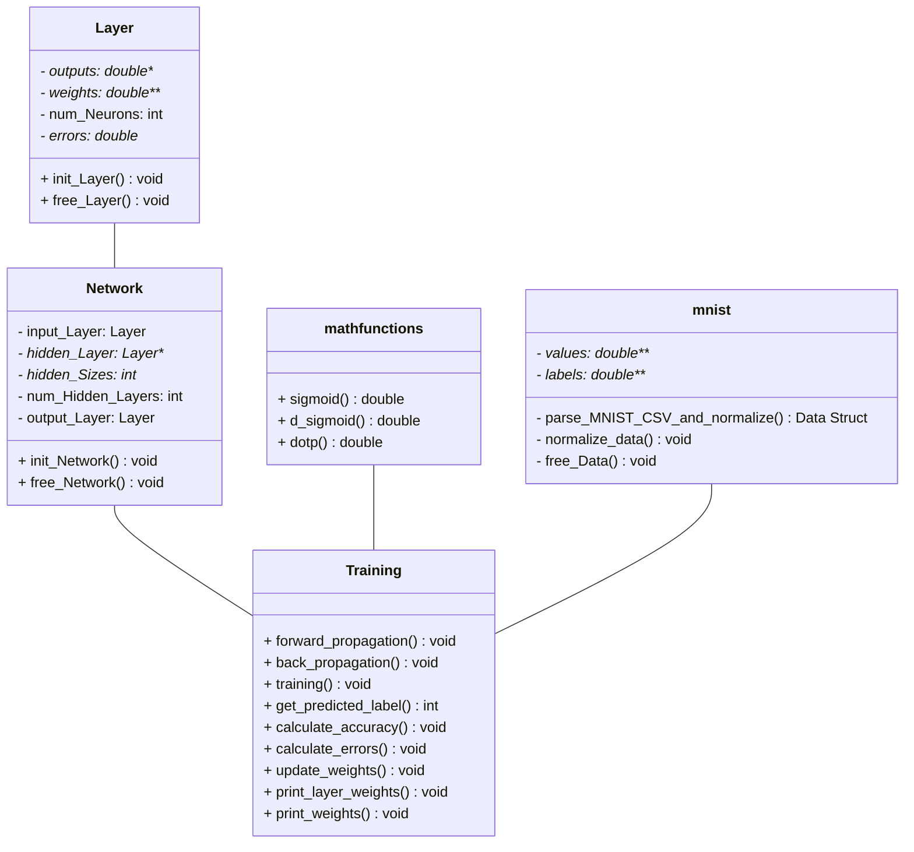

# TL;DR
Neuronal Network written from scratch in C. Three different implementations (Sequential, SIMD and [OMP](https://www.openmp.org/)) for the training will be benchmarked and compared.

## Main Goal
The main goal is to develop a _Neuronal Network_ (NN) in C from Scratch: 
- The NN should identify numbers or letters.
- The core algorithms should be implemented
  - sequential
  - SIMD (single use instruction, multiple data)
  - parallel (using [OpenMP](https://www.openmp.org/))
- The different training times should be compared 
- The compiler options _-Wall_, _-Werror_ and (if possible) _-fanalyzer_ should be used
- The Project sould be implemented using Unit-Tests (Test-Driven-Development)
- The Unit-Tests should use debugging-tools like [_helgrind_](https://valgrind.org/docs/manual/hg-manual.html)
- The build-process should be automated with a GitLab-Runner
- The user should be able to input different network-parameters through CLI or config-files. For example: number fof neurons, number of hidden-layers
- The user should get a visualization of the Input- and Output-Data
- The duration of the training-process using different parallelization should be analyzed and compared
- The code should be fully documented using Doxygen-Format
- The program should have a user-friendly UI 


In the end of the semester, the project should be presented in class.

## How to Build
The application can be built using [make](https://www.gnu.org/software/make/). 

```bash
Available targets:
  all                - Compile all versions (sequential, parallel, SIMD) and run unit tests
  compile-seq        - Compile the sequential version
  compile-parallel   - Compile the parallel version (with omp library)
  compile-simd       - Compile the SIMD version
  compile-all        - Compile all versions
  test               - Run tests
  clean              - Clean the build directory
  run-seq            - Run the sequential version
  run-parallel       - Run the parallel version (with omp library)
  run-simd           - Run the SIMD version
  docs               - Generate documentation using Doxygen
```


## UML Diagram
Even though C does not support OOP, I will try to take a detour. 
> Assume the classes: _Layer_ and _Network_ are Structs and the different Methods are Functions.



>__DISCLAIMER: Please don´t be very critical with the UML Diagram above yet. For now, it only helps me orientating before implementation__

# Benchmarks
I have used [hyperfine](https://github.com/sharkdp/hyperfine) for benchmarking.

On my machine,  AMD Ryzen 7 7730U, and [gcc-13.2.0](https://gcc.gnu.org/onlinedocs/gcc-13.2.0/gcc/) (with -O3 Optimization flag) these were the results:

```bash

Time(ms)     User(ms)     System(ms)   Command
1206.34      1206.06      0.24         "make run-simd"
1503.91      1503.60      0.25         "make run-seq"
3299.07      51667.67     89.63        "make run-parallel"
```


# Notes

This repository aims to document the research work related to the subject _Mikroprozessortechnik_ from Prof. Dr. Bauer.